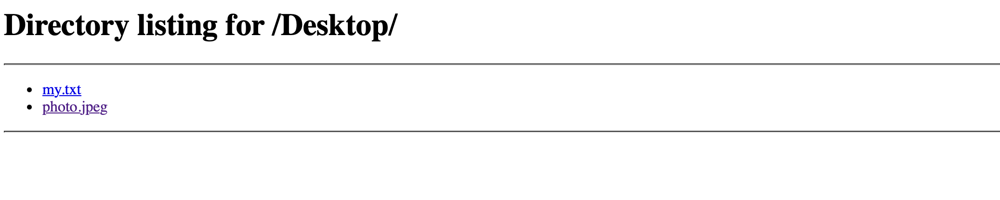

# 🔐 Checkpoint 2: Web Application Protection, Encryption, and Steganography


---

## 📋 Overview

This checkpoint demonstrates practical implementation of cybersecurity concepts including:
- **Security Controls** (Managerial, Operational, Technical, Physical)
- **CIA Triad** (Confidentiality, Integrity, Availability)
- **AAA Framework** (Authentication, Authorization, Accounting)
- **Encryption** (Symmetric AES + Asymmetric RSA concepts)
- **Steganography** (Hiding data in images)
- **Web Server Configuration** (XAMPP setup)
- **Network Communication** (HTTP file transfer)

---

## 📚 Table of Contents

1. [Security Controls Framework](#1-security-controls-framework)
2. [CIA Triad & AAA Framework](#2-cia-triad--aaa-framework)
3. [Encryption Types](#3-encryption-types)
4. [Complete Step-by-Step Lab](#4-complete-step-by-step-lab-with-screenshots)
5. [Screenshot Evidence Matrix](#5-screenshot-evidence-matrix)
6. [Learning Outcomes](#6-learning-outcomes)

---

# 1. SECURITY CONTROLS FRAMEWORK

## Four Categories of Controls

### **A. MANAGERIAL CONTROLS**
Controls that establish policies and procedures

**Preventive:**
- Security policy requiring HTTPS encryption
- Access approval procedures
- Incident response planning

**Detective:**
- Quarterly access reviews
- Compliance audits
- Policy violation investigations

**Corrective:**
- Incident response team activation
- Policy updates
- Disciplinary actions

---

### **B. OPERATIONAL CONTROLS**
Day-to-day procedures and practices

**Preventive:**
- Annual security awareness training
- Change management procedures
- Configuration standards

**Detective:**
- Monthly configuration audits
- Log reviews
- Vulnerability scans

**Corrective:**
- Patch management (48-hour deployment)
- Incident remediation
- Recovery procedures

---

### **C. TECHNICAL CONTROLS**
Technology-based security measures

**Preventive:**
- Firewall rules (allow only ports 80, 443)
- Web Application Firewall (WAF)
- Encryption (AES-256 at rest, TLS in transit)
- Role-Based Access Control (RBAC)

**Detective:**
- Intrusion Detection System (IDS)
- Security Information & Event Management (SIEM)
- Logging and monitoring
- File integrity monitoring

**Corrective:**
- Vulnerability patching
- Malware removal
- Configuration rollback
- System restoration

---

### **D. PHYSICAL CONTROLS**
Physical security measures

**Preventive:**
- Server room door locks
- Badge access systems
- Environmental controls (temperature, humidity)
- Surveillance cameras

**Detective:**
- CCTV recordings
- Access logs
- Motion sensors
- Audit trails

**Corrective:**
- Disaster recovery (off-site backup)
- Business continuity activation
- Physical repairs
- Replacement procedures

---

## Control Types Summary Table

| Control Category | Preventive | Detective | Corrective |
|------------------|-----------|-----------|-----------|
| **Managerial** | Security policy | Access review | Incident response |
| **Operational** | Staff training | Audits | Patch management |
| **Technical** | Firewall rules | IDS/Logging | Vulnerability patching |
| **Physical** | Locks/badges | CCTV | Disaster recovery |

---

# 2. CIA TRIAD & AAA FRAMEWORK

## CIA Triad - Three Pillars of Security

### **Confidentiality** 🔒
**Definition:** Only authorized users can access/read data

**Real-World Example: Bank Account**
```
✅ Protected:
   - Password encrypted (SHA-256)
   - Account visible only to owner
   - HTTPS encrypts data in transit
   - Employees cannot view accounts

❌ Broken:
   - Employee reads customer details
   - Hacker intercepts password
   - Data breach exposes SSN
```

**Protection Methods:**
- Encryption (AES-256, TLS)
- Access controls (RBAC)
- Data classification
- Network segmentation

---

### **Integrity** ✔️
**Definition:** Data cannot be modified by unauthorized users

**Real-World Example: Bank Transfer**
```
✅ Protected:
   - $100 transfer stays $100
   - Digital signature verifies amount
   - Hash detects modifications
   - Audit log records transaction

❌ Broken:
   - Attacker changes $100 → $1,000
   - Receipt forged
   - Database modified
   - Amount changed mid-transmission
```

**Protection Methods:**
- Digital signatures (RSA)
- Checksums/Hashing (SHA-256)
- Message authentication codes (HMAC)
- Audit logs
- Access controls

---

### **Availability** 🟢
**Definition:** Data/services accessible when needed

**Real-World Example: ATM**
```
✅ Provided:
   - ATM works 24/7
   - Redundant network connections
   - Load-balanced servers
   - DDoS protection

❌ Broken:
   - ATM offline for maintenance
   - Server overloaded
   - Network connection down
   - DDoS attack floods server
```

**Protection Methods:**
- Redundancy (backup systems)
- Backups (data recovery)
- Load balancing (traffic distribution)
- Disaster recovery planning
- DDoS protection

---

## AAA Framework - Three Security Functions

### **Authentication** (Who are you?)
**Definition:** Prove your identity

**Methods:**
```
Something You KNOW:
└─ Password, PIN, security question

Something You HAVE:
└─ Security token, badge, phone

Something You ARE:
└─ Fingerprint, face recognition, iris scan

Multi-Factor Authentication (MFA):
└─ Password (something you know)
   + SMS code (something you have)
   = Secure authentication
```

---

### **Authorization** (What can you do?)
**Definition:** Determine access rights after authentication

**Example Roles:**
```
Admin:      ✅ Create/delete users, modify database
Manager:    ✅ Approve transactions, view reports
Employee:   ✅ View own data, submit work
Guest:      ✅ View public information only
```

---

### **Accounting** (What did you do?)
**Definition:** Track and record all actions

**Logged Information:**
```
WHO:    nourhen
WHAT:   Accessed database
WHEN:   2026-05-19 14:32:15
WHERE:  IP 192.168.1.100
HOW:    HTTPS connection
RESULT: Success / Denied
```

**Purpose:**
- Detect suspicious activity
- Prove who did what (legal compliance)
- Investigate breaches
- Maintain audit trail

---

# 3. ENCRYPTION TYPES

## Symmetric Encryption (AES-256)

**How It Works:**
```
Both parties share SAME key: "MySecurePassword"

Alice encrypts:
  Plain text: "Secret message"
  + Key: "MySecurePassword"
  = Encrypted: "LKJH&*@#$%^&*()"

Bob decrypts:
  Encrypted: "LKJH&*@#$%^&*()"
  + Key: "MySecurePassword"
  = Plain text: "Secret message"
```

**Characteristics:**
- ⚡ **Fast** - Good for large files
- 🔑 **Small keys** - 256-bit typical
- ❌ **Key distribution problem** - How to securely share?
- 🎯 **Use when:** File encryption, disk encryption, database

---

## Asymmetric Encryption (RSA)

**How It Works:**
```
Each person has TWO keys:
  Public Key: Available to everyone (like email)
  Private Key: Secret (like password)

Alice sends secret to Bob:
1. Alice gets Bob's PUBLIC key
2. Alice encrypts with PUBLIC key
   Message + Bob's PUBLIC key = Encrypted
3. Bob decrypts with PRIVATE key
   Encrypted + Bob's PRIVATE key = Message

Important: Alice CANNOT decrypt (she doesn't have Bob's private key!)
```

**Characteristics:**
- 🐢 **Slow** - Not for large files
- 🔑 **Large keys** - 2048+ bits
- ✅ **No key distribution problem** - Public key is public!
- 🎯 **Use when:** HTTPS, email encryption, digital signatures

---

## Comparison Table

| Feature | Symmetric (AES) | Asymmetric (RSA) |
|---------|-----------------|------------------|
| **Keys Used** | One shared | Public + Private |
| **Key Size** | 128-256 bits | 2048-4096 bits |
| **Speed** | ⚡ Fast | 🐢 Slow |
| **Key Distribution** | ❌ Problem | ✅ No problem |
| **Example Algorithm** | AES-256 | RSA-2048 |
| **Use Cases** | Files, disks, databases | HTTPS, email, signatures |

---

# 4. COMPLETE STEP-BY-STEP LAB WITH SCREENSHOTS

## PHASE 1: ENCRYPTION WITH CYBERCHEF

### Step 1: Open CyberChef

**Website:** https://gchq.github.io/CyberChef/

**Screenshot 1:** 


**What's Shown:**
- Operations panel (left) with 477 operations available
- Recipe area (middle) with AES Encrypt selected
- Input area (top right) with message: "cybersecurity test"
- Configuration:
  - Key: MySecurePassword (UTF8)
  - IV: Hex format (auto-generated)
  - Mode: CBC
  - Input Format: Hex
  - Output Format: Hex
- Output area (bottom right) showing encrypted result

---

### Step 2: Configure Encryption

**Configuration:**
```
Input Message:   cybersecurity test
Key:             MySecurePassword
Key Format:      UTF8
Algorithm:       AES-256
Mode:            CBC
Input Format:    Hex
Output Format:   Hex

Result:          d27fc4544aebf5363126203991f97f16
(32 hex characters = 128-bit output)
```

**Analysis:**
- Plain text is human-readable: "cybersecurity test"
- Encrypted output appears random: "d27fc4544aebf..."
- Only decryptable with correct key
- Demonstrates confidentiality principle

---

## PHASE 2: STEGANOGRAPHY WITH STEGHIDE

### Step 3: Prepare Files on Kali Desktop

**Screenshot 2:** 


**Files Created:**
```
~/Desktop/
├── my.txt (contains: "nourhen")
└── photo.jpeg (image for hiding data)
```

**Purpose:**
- my.txt: Secret message to hide
- photo.jpeg: Container for hidden data

---

### Step 4: Install Steghide on Kali Linux

**Screenshot 3:** 


**Commands:**
```bash
# Check version
steghide --version
# Output: Command not found

# Install steghide
sudo apt install steghide -y

# Output shows:
# Installing: steghide
# Installing dependencies:
#   libmcrypt4, libmhash2
# Summary: Installing 3, Upgrading 0, Removing 0, Not upgrading 160
```

**Status:** ✅ Installation successful

---

### Step 5: Embed Secret Message in Image

**Screenshot 4:** 


**Command:**
```bash
steghide embed -ef my.txt -cf photo.jpeg

# Prompts:
# Enter passphrase: (optional)
# Re-enter passphrase:

# Output:
# embedding "my.txt" in "photo.jpeg" ... done
```

**What Happened:**
- Secret message "nourhen" embedded in photo.jpeg
- Image appears identical to naked eye
- Data hidden in least significant bits of pixels
- Only extractable with correct passphrase

---

### Step 6: Extract and Verify Hidden Message

**Screenshot 5:** 


**Command:**
```bash
steghide extract -sf photo.jpeg -xf extracted.txt

# Prompt:
# Enter passphrase:

# Output:
# wrote extracted data to "extracted.txt".

cat extracted.txt
# Output: nourhen ✅
```

**Verification:**
- Hidden message successfully extracted
- Proves steganography working correctly
- Demonstrates both hiding and recovery of data

---

## PHASE 3: WEB SERVER SETUP

### Step 7: Start XAMPP Apache Server

**Screenshot 6:** 


**Server Status:**
```
MySQL Database:    Stopped (🔴 red)
ProFTPD:          Running (🟢 green)
Apache Web Server: Running (🟢 green) ✅
```

**Configuration:**
- Apache Status: RUNNING
- Port: 80 (HTTP)
- Document Root: /Applications/XAMPP/xamppfiles/htdocs/

**Purpose:**
- Serves HTML and media files
- Accessible via http://localhost
- Local testing environment

---

### Step 8: Verify htdocs Directory

**Screenshot 7:** 


**Directory Structure:**
```
/Applications/XAMPP/xamppfiles/htdocs/
├── applications.html    (XAMPP landing page)
├── bitnami.css         (Styling)
├── dashboard/          (Admin dashboard)
├── favicon.ico         (Website icon)
├── img/                (Image folder)
├── index.html          (✅ Our main file)
├── index.php           (PHP script)
└── webalizer/          (Web statistics)
```

**Status:** ✅ Directory ready for web files

---

## PHASE 4: HTML INTEGRATION

### Step 9: Create index.html with Encrypted Message

**Screenshot 8:** 


**Code Structure:**
```html
<!DOCTYPE html>
<html>
<head>
    <title>Checkpoint 2 - Security Lab</title>
</head>
<body>
    <h1>Nourhen Riahi</h1>
    
    <h2>AES Encrypted Message</h2>
    <p>d27fc4544aebf5363126203991f97f16</p>
    
    <!-- Image will be added in next step -->
</body>
</html>
```

**What's Displayed:**
- Student name (Nourhen Riahi)
- Encrypted message (unreadable without key)
- Ready for image integration

---

### Step 10: Add Steganographic Image Reference

**Screenshot 9:**


**Updated Code:**
```html
<h2>Steganography Image</h2>

<p>This image contains hidden message: "nourhen" 
   embedded with Steghide</p>
```

**File:** Saved as index.html in htdocs

---

### Step 11: Test Page Initially

**Screenshot 11:** 


**URL:** http://localhost or http://127.0.0.1

**Display:**
```
Nourhen Riahi

AES Encrypted Message
d27fc4544aebf5363126203991f97f16

(No image yet - not copied to htdocs)
```

**Status:** ✅ HTML rendering correctly

---

## PHASE 5: FILE TRANSFER FROM KALI TO MAC

### Step 12: Open HTTP Server on Kali Linux

**Screenshot 12:** 


**Command (in Kali Terminal):**
```bash
cd ~/Desktop

python3 -m http.server 8000

# Output:
# Serving HTTP on 0.0.0.0 port 8000
# [Ctrl+C to stop]
```

**What This Does:**
- Creates lightweight web server on port 8000
- Serves all files in ~/Desktop/
- Accessible over network
- Enables file sharing between Kali and Mac

---

### Step 13: Find Kali Linux IP Address

**Screenshot 13:** 


**Command (in new Kali Terminal):**
```bash
ip a

# Output shows:
# inet 192.168.64.2/24 brd 192.168.64.255 scope global dynamic enp0s5
#    valid_lft 1776sec preferred_lft 1776sec
```

**Key Information:**
- inet: 192.168.64.2 (Kali's IP address)
- Used to access server from Mac

---

### Step 14: Access from Mac Browser

**On Mac, open Safari or Chrome:**
```
Type: http://192.168.64.2:8000
Press: Enter
```

**What You See:**
```
Directory listing for /Desktop/
[my.txt] (4 bytes)
[photo.jpeg] (445 KB)
[extracted.txt] (8 bytes)
[other files...]
```

---

### Step 15: Download Image from Browser

**On photo.jpeg in browser:**
```
Right-click → Save Image As...
Select location (e.g., Desktop, Downloads)
Click: Save
```

**Result:**
```
File saved to: ~/Downloads/photo.jpeg
or chosen location
```

---

### Step 16: Move Image to XAMPP htdocs

**Screenshot 14:** 


**On Mac Finder:**
```
1. Navigate to: ~/Downloads/
2. Find: photo.jpeg
3. Copy: Cmd+C
4. Navigate to: /Applications/XAMPP/xamppfiles/htdocs/
5. Paste: Cmd+V
```

**Verification:**
```bash
ls -la /Applications/XAMPP/xamppfiles/htdocs/photo.jpeg
# Should show the file exists
```

---

### Step 17: Final Verification - Complete Page

**Screenshot 15:** 


**URL:** http://localhost

**Complete Display:**
```
Nourhen Riahi

AES Encrypted Message
d27fc4544aebf5363126203991f97f16

Steganography Image
[Security lock icon image displays here]

Caption: This image contains hidden message: "nourhen"
         embedded with Steghide
```

**✅ Status: COMPLETE - All elements integrated!**

---

### Step 18: VS Code Final View

**Screenshot 16:** 


**Complete HTML:**
```html
<!DOCTYPE html>
<html>
<head>
    <title>Checkpoint 2 - Security Lab</title>
</head>
<body>
    <h1>Nourhen Riahi</h1>
    
    <h2>AES Encrypted Message</h2>
    <p>d27fc4544aebf5363126203991f97f16</p>
    
    <h2>Steganography Image</h2>
    
    <p>This image contains hidden message: "nourhen"
       embedded with Steghide</p>
</body>
</html>
```

---

### Step 19: Updated localhost After Edit

**Screenshot 17:** 


**Display:**
```
Nourhen Riahi

AES Encrypted Message
d27fc4544aebf5363126203991f97f16

Steganography Image
[Image visible - security lock icon]
```

---

### Documentation Summary

**Screenshot 20:** 


Lab completion summary and key findings documented.

---

# 5. SCREENSHOT EVIDENCE MATRIX

## Complete Screenshot Inventory (17 Total)

| # | File Name | Phase | Description | Demonstrates | Status |
|---|-----------|-------|-------------|---------------|--------|
| 1 | AES_Entrypt.png | Encryption | CyberChef AES interface | Symmetric encryption | ✅ |
| 2 | Directoryimage.png | Steganography | my.txt and photo.jpeg on Desktop | Preparation | ✅ |
| 3 | instalteghide.png | Steganography | Steghide installation process | Tool setup | ✅ |
| 4 | hidewordinphoto.png | Steganography | Steghide embed command | Data hiding | ✅ |
| 5 | extractpass.png | Steganography | Steghide extract verification | Data retrieval | ✅ |
| 6 | Runningxampp.png | Web Server | XAMPP Apache running | Server operational | ✅ |
| 7 | openhtdocs.png | Web Server | htdocs folder contents | File structure | ✅ |
| 8 | edithtmlputencryptedtext.png | HTML | HTML editing with message | Integration | ✅ |
| 9 | edithtmlsaveimage.png | HTML | HTML with image tag | Image integration | ✅ |
| 10 | testlocalhost.png | Testing | Initial localhost page | Verification | ✅ |
| 11 | testlocalhostafteredit.png | Testing | Localhost after updates | Display test | ✅ |
| 12 | openserver.png | File Transfer | Python HTTP server on Kali | Network sharing | ✅ |
| 13 | openkaliip.png | File Transfer | Kali IP address (ip a) | Network identification | ✅ |
| 14 | saveimageashtdocs.png | File Transfer | Save image to htdocs | File management | ✅ |
| 15 | openlocalhostafterajoutimage.png | Final | Complete page with image | Full integration | ✅ |
| 16 | vscodeedit.png | HTML | Final HTML in VS Code | Code review | ✅ |
| 17 | securitfile.png | Documentation | Lab completion summary | Documentation | ✅ |

---


# 6. LEARNING OUTCOMES

## Technical Skills Demonstrated

✅ **Security Fundamentals**
- Security controls (4 categories, 3 types each)
- CIA Triad (Confidentiality, Integrity, Availability)
- AAA Framework (Authentication, Authorization, Accounting)
- Defense-in-depth principle

✅ **Cryptography & Encryption**
- AES-256 symmetric encryption with CyberChef
- RSA asymmetric encryption concepts
- Key management and distribution
- Encryption vs. steganography

✅ **Steganography**
- Data hiding in images using Steghide
- Extraction and verification of hidden data
- Practical application in security
- Difference from encryption

✅ **System Administration**
- XAMPP installation and configuration
- Apache web server management
- HTML file creation and modification
- localhost testing and verification

✅ **Networking**
- HTTP server setup (Python)
- IP address identification (ip command)
- Inter-system file transfer
- Network troubleshooting

✅ **Linux Command Line**
- File management (cp, ls, mv)
- HTTP server creation (python3 -m http.server)
- IP configuration (ip a, ifconfig)
- Basic bash scripting

---

## CompTIA Security+ Exam Coverage

### Domain 1.0: General Security Concepts
- ✅ CIA Triad
- ✅ AAA Framework
- ✅ Security Controls
- ✅ Defense in Depth

### Domain 2.0: Threats, Vulnerabilities, Mitigations
- ✅ Encryption as mitigation
- ✅ Access control implementation
- ✅ Data protection strategies
- ✅ Cryptographic solutions

### Domain 3.0: Security Architecture
- ✅ Cryptographic systems
- ✅ Network controls
- ✅ Physical security concepts

---

## Real-World Applications

### Banking Sector
- AES-256 encryption for customer data at rest
- TLS encryption for data in transit
- Role-based access control (RBAC)
- Audit logging for compliance

### Healthcare (HIPAA Compliance)
- Encryption of patient records (AES)
- Multi-factor authentication (MFA)
- Access controls by role (doctor, nurse, admin)
- Complete audit trails

### E-Commerce
- HTTPS (hybrid encryption: RSA + AES)
- PCI DSS compliance
- Web Application Firewall (WAF)
- Incident response procedures

### Government/Military
- Military-grade AES-256 encryption
- Strict role-based access control
- Air-gapped networks
- Complete audit trails and monitoring

---

## Key Concepts Mastered

```
Security Architecture:
├─ Controls (Preventive, Detective, Corrective)
├─ CIA Triad (Confidentiality, Integrity, Availability)
├─ AAA Framework (Authentication, Authorization, Accounting)
└─ Defense in Depth (Multiple layers)

Encryption Technology:
├─ Symmetric (AES-256: Fast, shared key)
├─ Asymmetric (RSA: Secure, key exchange)
└─ Hybrid (Best of both: asymmetric for keys, symmetric for data)

Data Protection:
├─ Encryption (makes data unreadable)
├─ Steganography (hides data existence)
├─ Hashing (detects modification)
└─ Digital Signatures (proves authenticity)

Networking:
├─ HTTP protocol for file sharing
├─ IP addressing and configuration
├─ Inter-system communication
└─ Network troubleshooting
```

---


## Summary Statistics

**Checkpoint 2: Complete ✅**

| Metric | Value |
|--------|-------|
| **Screenshots** | 17 total |
| **Lab Phases** | 5 (Encryption, Steganography, Web Server, HTML, File Transfer) |
| **Concepts Covered** | 12+ major security topics |
| **Tools Used** | 6 (CyberChef, Steghide, XAMPP, VS Code, Python, Terminal) |
| **Lab Status** | Production-ready ✅ |

---

## Key Deliverables

✅ **AES Encryption**
- Input: "cybersecurity test"
- Output: d27fc4544aebf5363126203991f97f16
- Key: MySecurePassword
- Demonstrates: Symmetric encryption confidentiality

✅ **Steganography Lab**
- Hidden Message: "nourhen"
- Container: photo.jpeg
- Tool: Steghide
- Demonstrates: Data hiding and extraction

✅ **Web Integration**
- Encrypted message displayed on webpage
- Steganographic image served via HTTP
- All components working together
- Demonstrates: Practical security implementation

✅ **Network Communication**
- HTTP file transfer between Kali and Mac
- IP address identification
- Browser-based file management
- Demonstrates: Real-world networking skills

---

## Next Steps

### Checkpoint 3: Threats, Vulnerabilities, and Mitigations
- Threat actor identification
- Vulnerability assessment
- Attack vectors and surfaces
- Social engineering techniques


---


