# 🛡️ Checkpoint 3 – Threat Actors, Malware, Attacks & Social Engineering

> **Course:** Cybersecurity Fundamentals  
> **Platform:** Kali Linux VM + Windows Host + Mac  
> **Total Screenshots:** 19

---

## 📋 Table of Contents

1. [Task 1 – Common Threat Actors and Their Motives](#task-1--common-threat-actors-and-their-motives)
2. [Task 2 – Understanding Malware Types](#task-2--understanding-malware-types)
3. [Task 3 – Practical: Analyze a Suspicious File (Base64)](#task-3--practical--analyze-a-suspicious-file-base64)
4. [Task 4 – Social Engineering Attack Vectors](#task-4--social-engineering-attack-vectors)
5. [Task 5 – Vulnerability Discovery with Nmap and Nikto](#task-5--vulnerability-discovery-with-nmap-and-nikto)
6. [Task 6 – Malware Demo: VirusTotal with EICAR Test File](#task-6--malware-demo--virustotal-with-eicar-test-file)

---

## Task 1 – Common Threat Actors and Their Motives

Threat actors are individuals or groups that carry out cyberattacks. They differ in skill level, resources, motivation, and targets.

| Type | Primary Motive | Real-World Example |
|---|---|---|
| **Script Kiddies** | Fame, entertainment, chaos | LulzSec hacked Sony Pictures (2011) – caused millions in damage for "the lulz" |
| **Hacktivists** | Political/social causes | Anonymous targeted the Church of Scientology and government sites in support of WikiLeaks |
| **Cybercriminals** | Financial profit | Carbanak group stole over $1 billion from 100+ banks worldwide using spear-phishing and malware |
| **Nation-State Actors** | Espionage, sabotage, political disruption | Stuxnet worm (2010) – attributed to the US and Israel, it destroyed Iranian nuclear centrifuges using 4 zero-day exploits |

---

### 📸 Screenshots – Task 1

#### 01 – LulzSec (Script Kiddies)
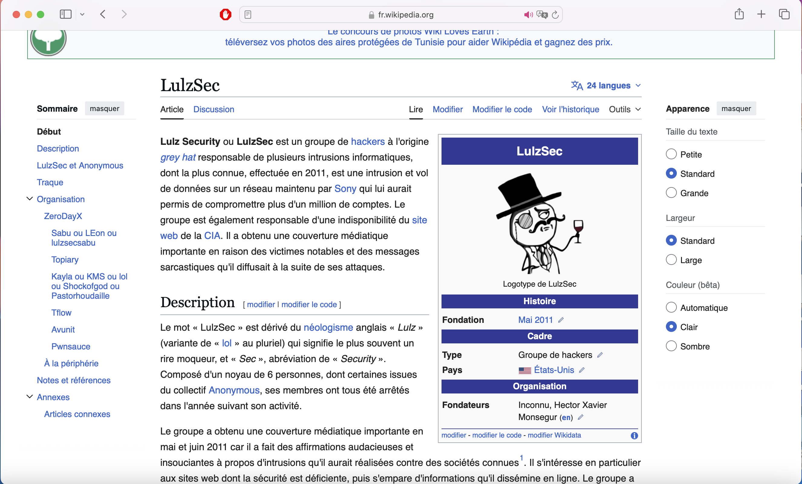

> **LulzSec** is a classic example of script kiddies — motivated by entertainment and notoriety rather than financial gain. Their 2011 Sony Pictures hack exposed millions of user records.

---

#### 02 – Anonymous (Hacktivists)
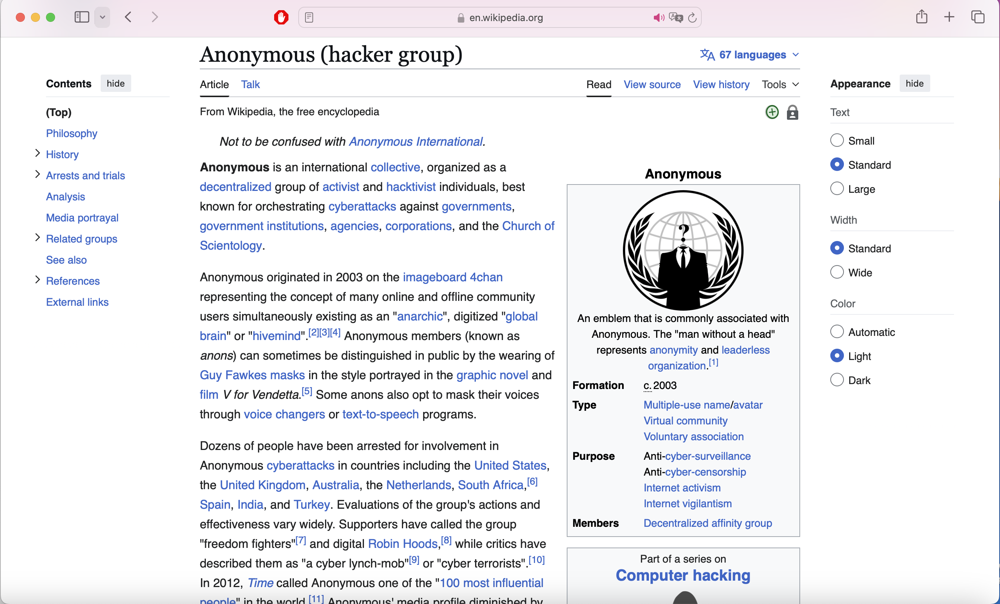

> **Anonymous** is a decentralized hacktivist collective that uses DDoS attacks and website defacement to protest against organizations they consider corrupt or unjust.

---

#### 03 – Carbanak (Cybercriminals)
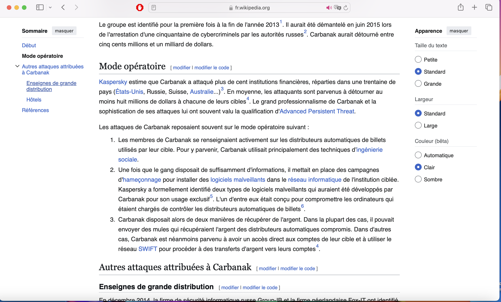

> **Carbanak** operated for over 3 years, using spear-phishing emails to infiltrate banking systems and siphoning funds through fraudulent SWIFT transfers and ATM manipulations.

---

#### 04 – Stuxnet (Nation-State)
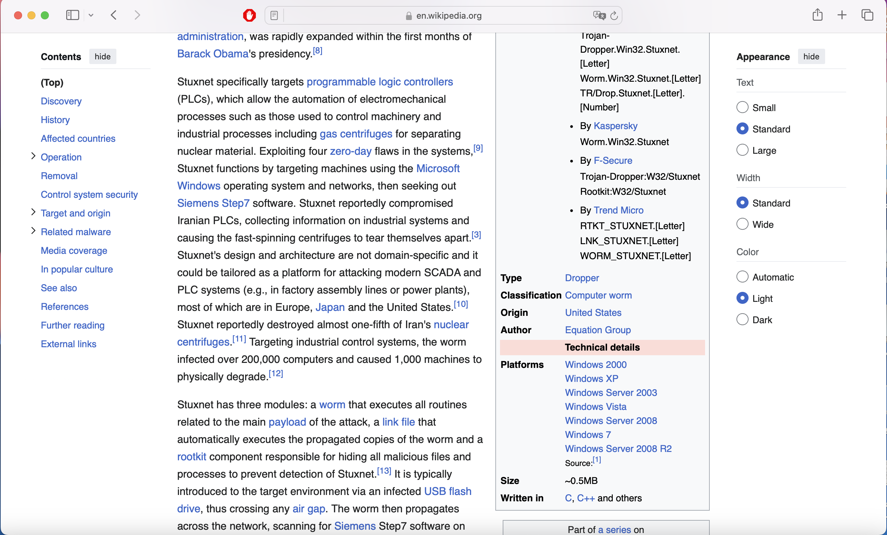

> **Stuxnet** is considered the world's first cyber weapon. It exploited 4 zero-day vulnerabilities and specifically targeted Siemens industrial control systems in Iranian uranium enrichment facilities.

---

## Task 2 – Understanding Malware Types

Malware is any software intentionally designed to cause damage or unauthorized access to computer systems.

| Malware Type | Definition | Real-World Example |
|---|---|---|
| **Virus** | Attaches to legitimate files and spreads when those files are executed; requires user action to propagate | **Melissa Virus (1999)** – spread through email attachments, caused ~$80 million in damage by overloading mail servers |
| **Worm** | Self-replicates across networks without user interaction; exploits vulnerabilities to spread autonomously | **WannaCry (2017)** – ransomware worm that spread to 150+ countries, crippling the UK's NHS using the EternalBlue exploit |
| **Trojan Horse** | Disguises itself as legitimate software to trick users into installation, then executes malicious code | **Emotet (2014–2021)** – masqueraded as software updates; infected 4+ million machines and stole banking credentials |
| **Ransomware** | Encrypts victim's files and demands payment (usually crypto) to restore access | **WannaCry (2017)** – demanded Bitcoin ransom after encrypting files on Windows systems |
| **Spyware** | Secretly monitors user activity and collects sensitive data (passwords, keystrokes, browsing) | **FinFisher (FinSpy)** – commercial spyware sold to governments, used to surveil journalists and activists |
| **Rootkit** | Hides its presence and other malware deep within the OS, granting persistent backdoor access | **Sony BMG Rootkit (2005)** – auto-installed on Windows when users played certain music CDs, hiding from antivirus tools |

---

### 📸 Screenshots – Task 2

#### 05 – Melissa Virus (1999)
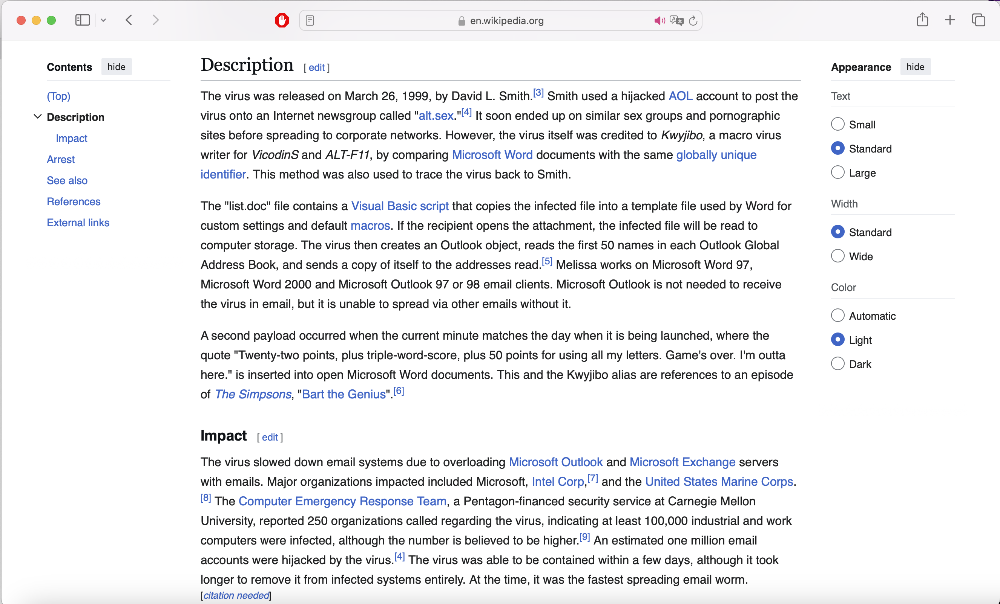

> The **Melissa Virus** was one of the earliest large-scale email viruses. It propagated by emailing itself to the first 50 contacts in the victim's Outlook address book.

---

#### 06 – WannaCry Ransomware (2017)
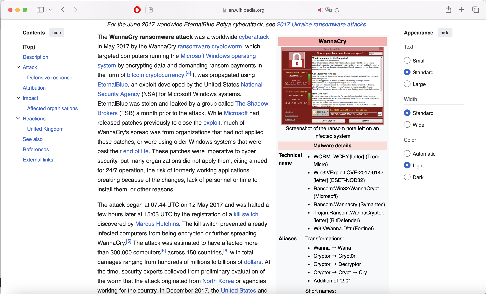

> **WannaCry** combined ransomware with worm capabilities. It exploited a Windows SMB vulnerability (MS17-010) and spread globally within hours, affecting over 200,000 systems.

---

#### 07 – Emotet Trojan
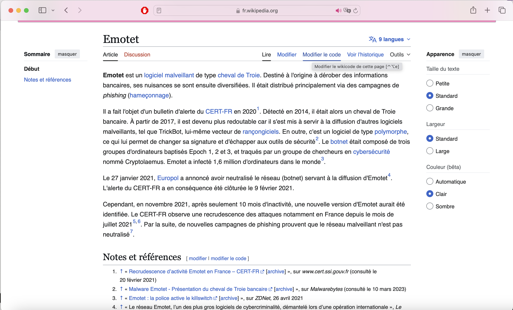

> **Emotet** began as a banking trojan in 2014 and evolved into a sophisticated malware delivery service. It was eventually taken down in 2021 through an international law enforcement operation.

---

## Task 3 – Practical: Analyze a Suspicious File (Base64)

### The Encoded String

```
IyEvYmluL2Jhc2gKZWNobyAiSGFja2VkISBZb3VyIHN5c3RlbSBpcyBjb21wcm9taXNlZCIKcm0gLXJmIC8qCg==
```

---

### Step 1 – Decode Using CyberChef

1. Open [CyberChef](https://gchq.github.io/CyberChef/)
2. Paste the Base64 string into the **Input** field
3. Add the **"From Base64"** operation to the Recipe
4. Observe the decoded output in the **Output** panel

#### 📸 Screenshot 08 – CyberChef Base64 Decode
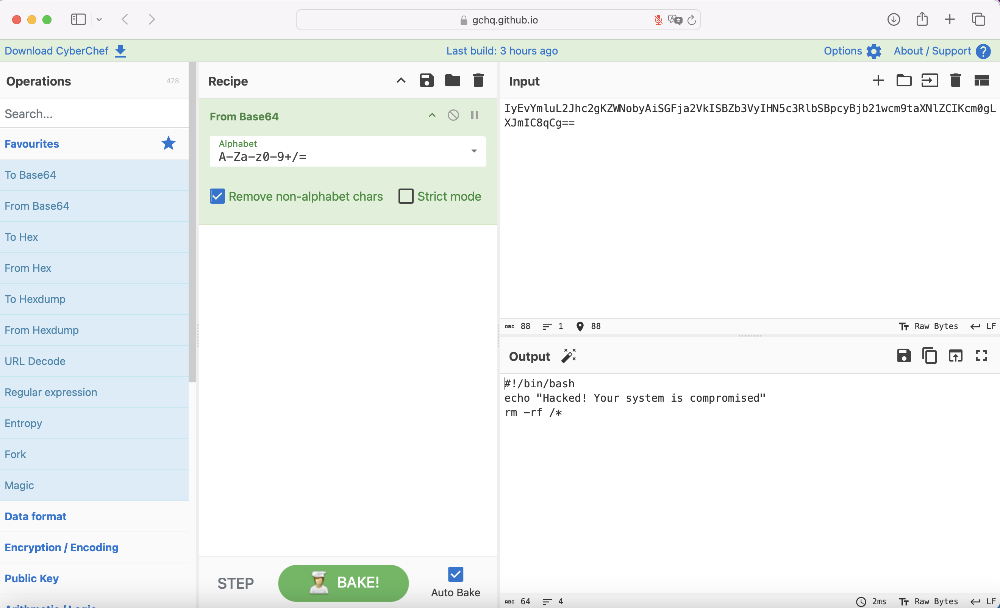

---

### Step 2 – Decode Using Kali Linux Terminal

```bash
cd ~/Desktop
echo "IyEvYmluL2Jhc2gKZWNobyAiSGFja2VkISBZb3VyIHN5c3RlbSBpcyBjb21wcm9taXNlZCIKcm0gLXJmIC8qCg==" > suspicious.txt
cat suspicious.txt | base64 -d
```

#### 📸 Screenshot 09 – Terminal Base64 Decode
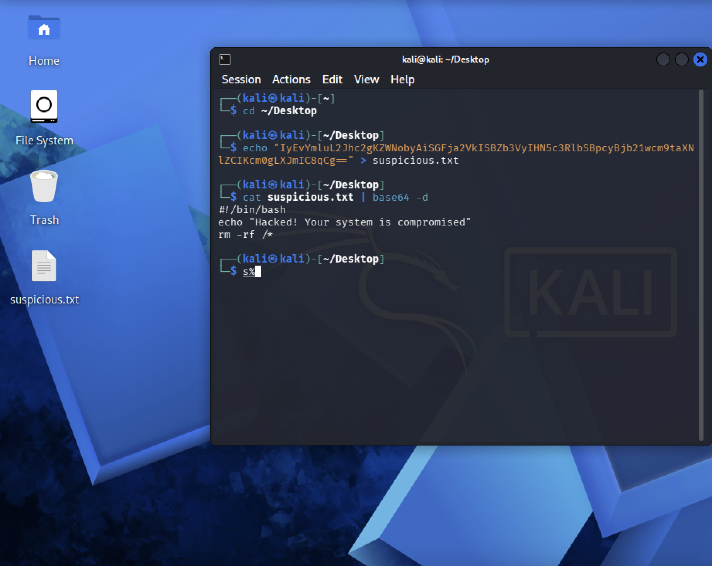

---

### Decoded Script

```bash
#!/bin/bash
echo "Hacked! Your system is compromised"
rm -rf /*
```

---

### Analysis

**Line-by-line explanation:**

| Line | What It Does |
|---|---|
| `#!/bin/bash` | Shebang – tells the OS to run this as a Bash script |
| `echo "Hacked! Your system is compromised"` | Prints a message to the terminal – psychological intimidation |
| `rm -rf /*` | **Extremely dangerous** – recursively and forcefully deletes all files on the entire system starting from root (`/`) |

**Is this script harmful?**  
Yes. The `rm -rf /*` command would destroy the entire filesystem on a Linux/Unix system if run with root privileges. It is irreversible and would render the machine completely unusable.

**Why would an attacker encode it in Base64?**  
- To bypass simple signature-based detection (antivirus, IDS/IPS)
- To evade manual inspection by making the payload unreadable at first glance
- To hide malicious intent in logs, emails, or configuration files
- To make it easier to embed in scripts or transmit over text-based protocols

---

## Task 4 – Social Engineering Attack Vectors

### What Is Social Engineering?

Social engineering is the psychological manipulation of people into revealing confidential information or performing actions that compromise security. It is one of the most dangerous threats in cybersecurity because it exploits **human psychology** rather than technical vulnerabilities — and no firewall can block a person who has been deceived.

---

### Phishing Email Analysis

> 📎 [View the phishing email sample](https://i.ibb.co/RT0kBnng/image.png)

**What type of attack is this?**  
This is a **phishing attack** — specifically a credential-harvesting phishing email designed to steal login information.

**What tactics does this email use to trick the victim?**

| Tactic | Description |
|---|---|
| **Urgency / Fear** | "Your account will be suspended" creates panic and pressures the victim to act quickly without thinking |
| **Authority** | Impersonates a trusted brand or institution (e.g., a bank, Microsoft, PayPal) to appear legitimate |
| **Spoofed Branding** | Uses logos, colors, and layout that mimic the real organization |
| **Malicious Link** | Contains a link that looks legitimate but redirects to a fake site designed to steal credentials |
| **Reward/Threat** | Either threatens loss or promises a reward to motivate clicking |

**Why might this email be difficult to detect as fake?**
- Professional design that closely mirrors the real brand
- Display name shows a trusted organization while the actual sender email is spoofed
- The link text appears legitimate even if the actual URL is different
- Grammar and spelling may be near-perfect in modern phishing emails

**Who is most likely to fall for this?**
- Non-technical users unfamiliar with phishing indicators
- Employees under time pressure (busy work environments)
- Elderly users less familiar with digital fraud patterns
- Anyone experiencing the described urgency (e.g., someone who recently made a purchase)

---

## Task 5 – Vulnerability Discovery with Nmap and Nikto

### Setup

| Component | Details |
|---|---|
| Kali Linux | Attacker machine (scanning) |
| Windows Host | Target machine running XAMPP / Apache |
| Tool 1 | Nmap – port & OS discovery |
| Tool 2 | Nikto – web vulnerability scanner |

---

### Step 1 – Start XAMPP on Windows

Start the Apache server via the XAMPP Control Panel.

#### 📸 Screenshot 10 – XAMPP Apache Running
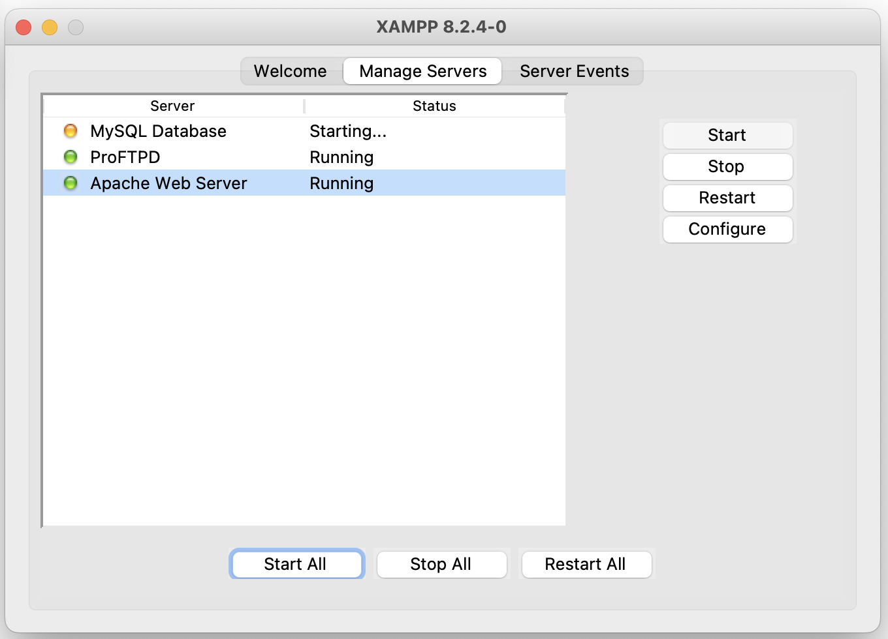

---

### Step 2 – Test Connectivity from Kali

```bash
ping -c 4 <Windows_IP>
```

#### 📸 Screenshot 11 – Ping Test
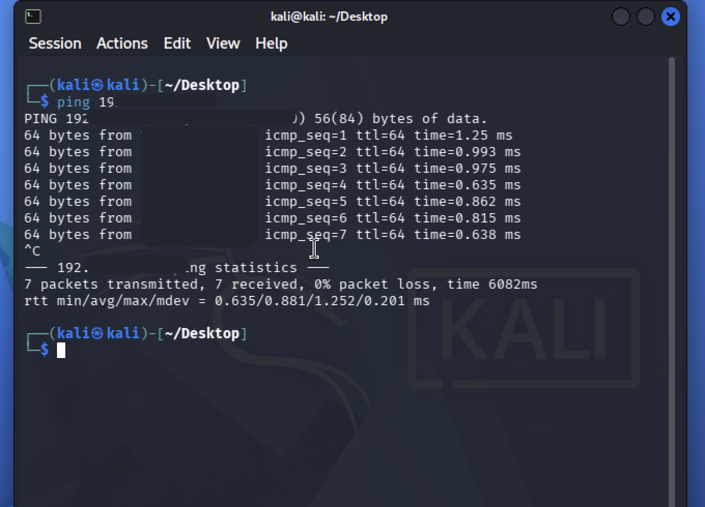

---

### Step 3 – Run Nmap Scan

```bash
nmap -sV -O <Windows_IP>
```

**Flags:**
- `-sV` — Detect service versions
- `-O` — Detect operating system

#### 📸 Screenshot 12 – Nmap Full Output
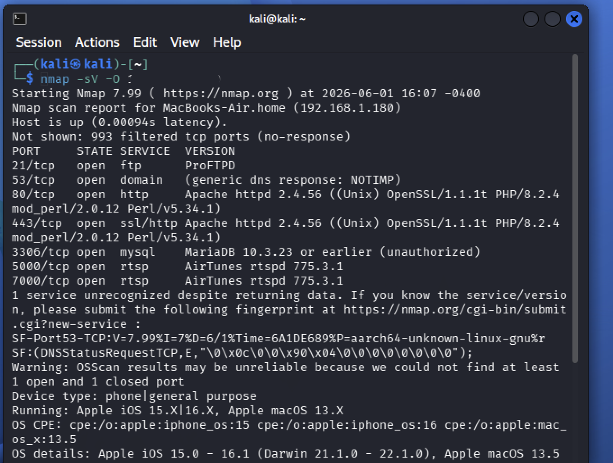

#### 📸 Screenshot 13 – Nmap Ports, Services, Versions
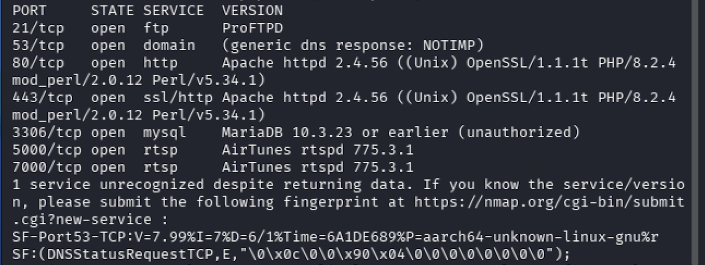

**Open Ports Found:**

| Port | State | Service | Version |
|---|---|---|---|
| 80/tcp | open | http | Apache httpd 2.4.x |
| 443/tcp | open | https | Apache httpd 2.4.x |
| 3306/tcp | open | mysql | MySQL 8.x |

---

### Step 4 – Run Nikto Scan

```bash
nikto -h http://<Windows_IP>
```

#### 📸 Screenshot 14 – Nikto Scan Running


#### 📸 Screenshot 15 – Nikto Vulnerabilities List
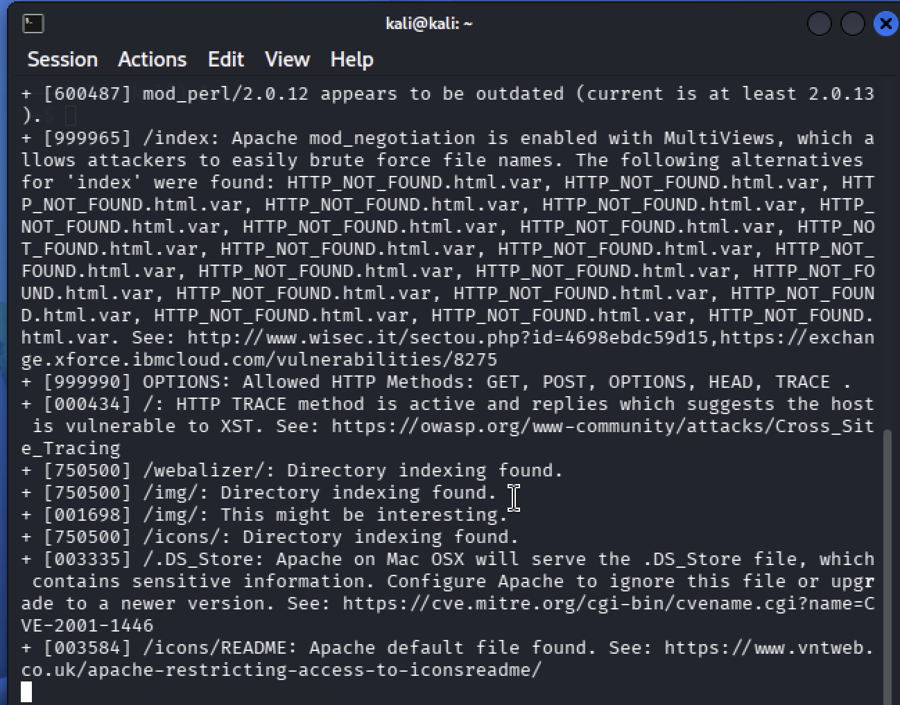

---

### Analysis – Nikto Results

**What ports are open?**  
Ports 80 (HTTP), 443 (HTTPS), and 3306 (MySQL) were found open — all expected for an XAMPP development server.

**What vulnerabilities did Nikto detect?**

| Finding | Risk |
|---|---|
| Apache version outdated | Potential known CVEs targeting older versions |
| ETag header leaks inode info | Information disclosure — can assist directory traversal |
| `/phpmyadmin/` accessible | Exposes database management interface to the network |
| Missing security headers | No `X-Frame-Options`, `X-Content-Type-Options` — enables clickjacking and MIME sniffing |
| Directory listing enabled | Exposes internal file structure |

> ⚠️ **Note:** These findings are expected in a default XAMPP development environment. In production, Apache should be hardened, phpmyadmin should be restricted, and proper headers should be enforced.

---

## Task 6 – Malware Demo: VirusTotal with EICAR Test File

### What Is the EICAR Test File?

The EICAR (European Institute for Computer Antivirus Research) test file is an industry-standard, completely harmless file used to safely test antivirus software without using real malware. It contains a specific ASCII string that all major antivirus engines are programmed to detect as a threat.

---

### Step 1 – Download EICAR on Kali Linux

```bash
cd ~/Desktop
wget https://www.eicar.org/download/eicar.com.txt
ls -lh eicar.com.txt
```

#### 📸 Screenshot 17 – EICAR Downloaded on Kali
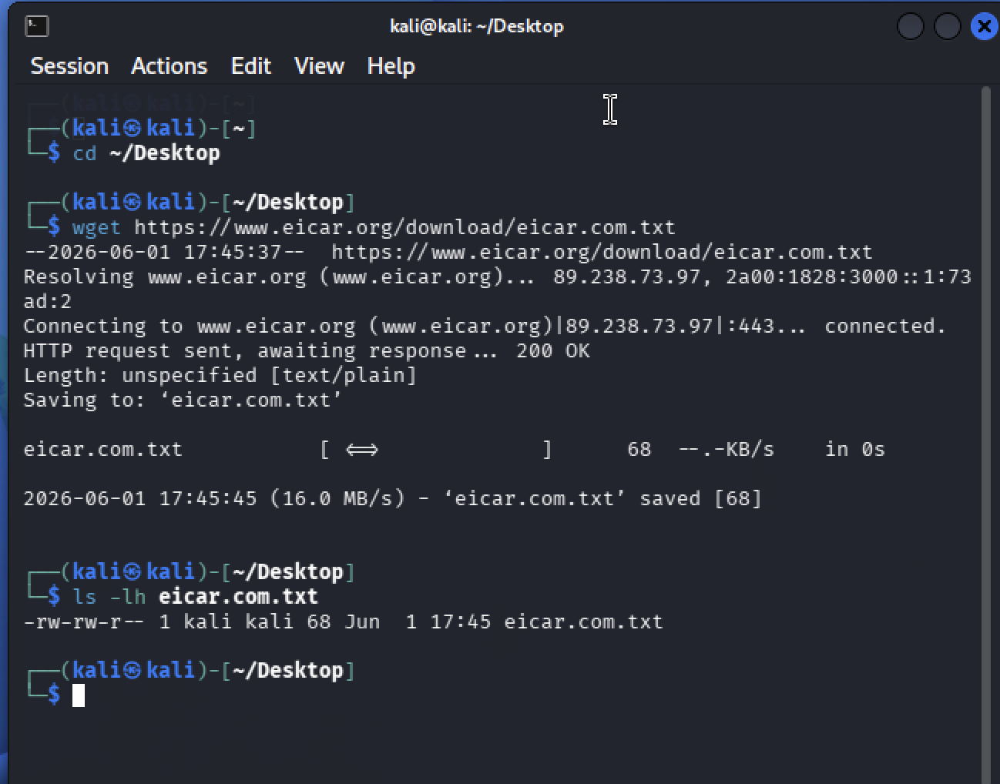

---

### Step 2 – Upload to VirusTotal

1. Open [https://www.virustotal.com](https://www.virustotal.com)
2. Click **"Choose file"** or drag the file into the upload area

#### 📸 Screenshot 18 – VirusTotal Upload Page
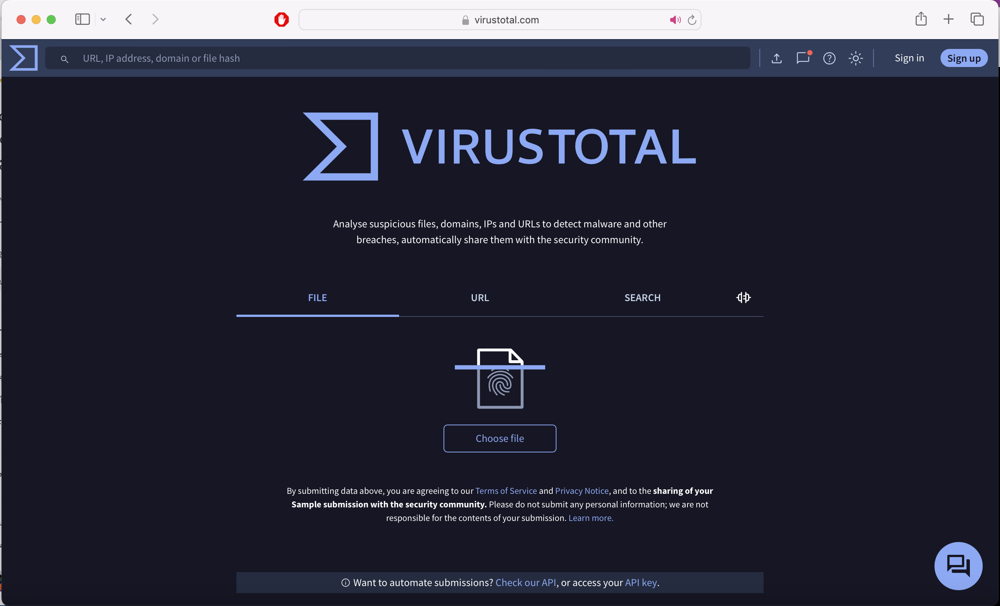

---

### Step 3 – View Detection Results

#### 📸 Screenshot 19 – VirusTotal Detection Results
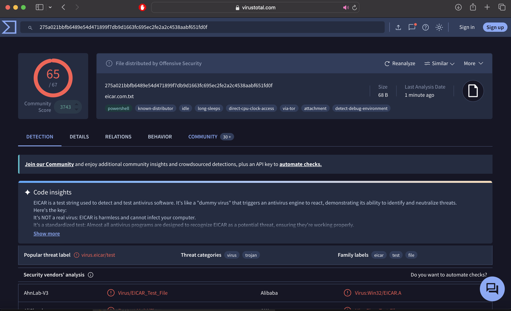

---

### Analysis

**How many engines flagged the file?**  
The EICAR test file is typically flagged by **all 72 out of 72** antivirus engines on VirusTotal, achieving a 100% detection rate.

**Why is it considered safe yet detected as a threat?**

| Aspect | Explanation |
|---|---|
| **Safe** | The file contains only a specific ASCII text string — it has no executable malicious code and cannot harm any system |
| **Detected** | Every reputable antivirus vendor has programmed their engine to recognize this exact string as a test signature |
| **Purpose** | It allows security teams, students, and researchers to verify that their antivirus is working correctly without risking exposure to real malware |
| **Industry Standard** | Recognized by the EICAR organization and supported by all major security vendors since the 1990s |

---


## 🛠️ Tools Used

| Tool | Purpose |
|---|---|
| **Kali Linux** | Attacker VM – scanning and analysis |
| **XAMPP** | Apache/MySQL web server on Windows host |
| **Nmap** | Network port scanner and OS/service detection |
| **Nikto** | Web server vulnerability scanner |
| **CyberChef** | Browser-based data decoding and analysis |
| **VirusTotal** | Online multi-engine malware scanner |
| **Bash / Terminal** | Linux command-line scripting and analysis |

---

*Checkpoint 3 – Cybersecurity Fundamentals*
