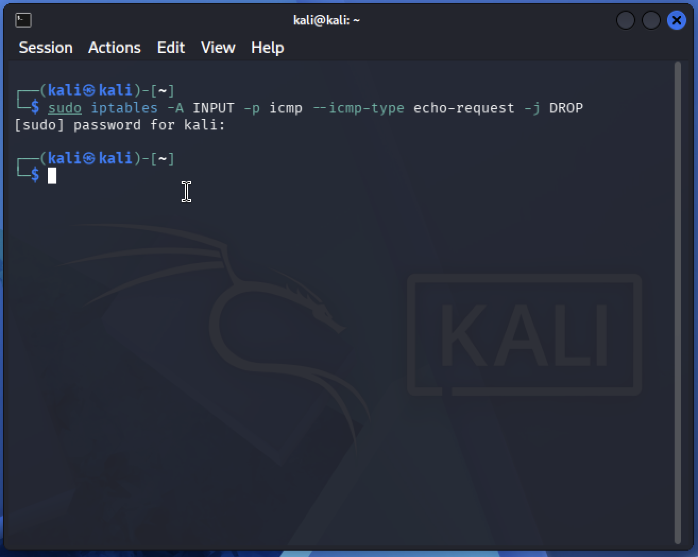
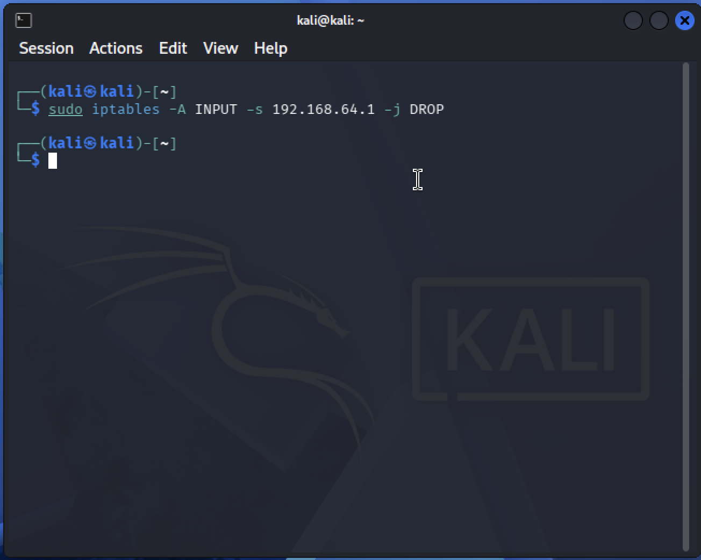

# Checkpoint 4: Infrastructure Protection, Zones, Firewall, Data Classification & Resiliency

This checkpoint covers securing infrastructure components (servers, hosts, networks), cloud service models, network zoning, firewall/IDS/IPS concepts, a hands-on `iptables` lab on Kali Linux, data classification, and backup vs. resiliency planning.

---

## Table of Contents

1. [Infrastructure Protection – Security Administrator Perspective](#1-infrastructure-protection--security-administrator-perspective)
2. [Cloud Service Models – IaaS, PaaS, SaaS](#2-cloud-service-models--iaas-paas-saas)
3. [Server Placement – Network Architecture Planning](#3-server-placement--network-architecture-planning)
4. [Firewall vs IDS vs IPS](#4-firewall-vs-ids-vs-ips)
5. [Practical Task – Using iptables on Kali Linux](#5-practical-task--using-iptables-on-kali-linux)
6. [Data Classification Types + Scenario](#6-data-classification-types--scenario)
7. [Backup vs Resiliency](#7-backup-vs-resiliency)

---

## 1. Infrastructure Protection – Security Administrator Perspective

As a Security Administrator, protection is applied at three layers: **server**, **host/endpoint**, and **network**.

### 🖥️ Server Protection (e.g., web server)

- Keep the OS and all software (Apache, PHP, MySQL/MariaDB in XAMPP, etc.) patched and updated.
- Disable unused services, ports, and default accounts.
- Apply the principle of **least privilege** to file permissions and service accounts.
- Use a **Web Application Firewall (WAF)** to filter malicious HTTP traffic.
- Enable **HTTPS/TLS** encryption instead of plain HTTP.
- Configure host-based firewall rules (`iptables`/`ufw`) to only allow required ports (80, 443, 22).
- Enable logging and monitoring (e.g., `auditd`, centralized SIEM logging).
- Regularly back up server configuration and data.
- Harden the server using CIS benchmarks.

### 💻 Host/Endpoint Protection (e.g., employee machines)

- Install and update **antivirus/EDR (Endpoint Detection & Response)** software.
- Enforce **strong password policies** and **Multi-Factor Authentication (MFA)**.
- Apply OS and application patches automatically.
- Use **disk encryption** (BitLocker, LUKS) to protect data at rest.
- Restrict local admin rights; use standard user accounts for daily work.
- Deploy **endpoint firewalls** and application allow-listing.
- Enforce **security awareness training** to reduce phishing/social engineering risk.
- Use **Mobile Device Management (MDM)** for company-owned devices.

### 🌐 Network Protection

- Segment the network into zones (e.g., DMZ, internal LAN, guest network) using VLANs.
- Deploy **firewalls** at network borders to control traffic flow.
- Use **IDS/IPS** to detect and block malicious traffic.
- Implement **VPNs** for secure remote access.
- Use **network access control (NAC)** to authenticate devices before granting access.
- Monitor traffic with a **SIEM** for anomaly detection.
- Apply **network segmentation** so a breach in one zone doesn't spread to others.

---

## 2. Cloud Service Models – IaaS, PaaS, SaaS

| Model                                  | What the Provider Manages                              | What You Manage                             | Example                                      |
| -------------------------------------- | ------------------------------------------------------ | ------------------------------------------- | -------------------------------------------- |
| **IaaS** (Infrastructure as a Service) | Physical hardware, virtualization, networking, storage | OS, middleware, runtime, applications, data | AWS EC2, Azure VMs, Google Compute Engine    |
| **PaaS** (Platform as a Service)       | Hardware + OS + runtime environment                    | Application code and data                   | Heroku, Azure App Service, Google App Engine |
| **SaaS** (Software as a Service)       | Everything (infrastructure, platform, application)     | Just your data and user configuration       | Gmail, Office 365, Salesforce                |

### Follow-up: Migrating the XAMPP Web Application

The most suitable model would be **PaaS (Platform as a Service)**.

**Why:**

- XAMPP bundles Apache, PHP, and MySQL — a PaaS provider (e.g., Azure App Service, Google App Engine, Heroku) already gives a managed runtime for PHP + a managed database, so there's no need to configure and patch the OS or web server manually.
- It reduces administrative overhead (patching, OS hardening, scaling) while still giving full control over the application code and database schema.
- It's faster to deploy and scale than IaaS, and more flexible than SaaS (which wouldn't allow custom application code at all).

_(If full control over the OS/network stack were required — e.g., custom firewall rules or non-standard services — IaaS would be the alternative choice.)_

---

## 3. Server Placement – Network Architecture Planning

### The Zone: **DMZ (Demilitarized Zone)**

Public-facing servers (web servers, mail servers, DNS servers) are placed in the **DMZ** — a buffer network segment between the untrusted internet and the trusted internal network. This ensures that if the public server is compromised, the attacker still cannot directly reach the internal LAN.

### Network Diagram

```
                              ┌───────────────────────────────────────────┐
                              │                 INTERNET                   │
                              └───────────────────┬─────────────────────┘
                                                  │
                                     ┌────────────▼────────────┐
                                     │   External Firewall      │
                                     │ (filters internet traffic)│
                                     └────────────┬────────────┘
                                                  │
                              ┌───────────────────▼───────────────────┐
                              │                  DMZ                   │
                              │   ┌─────────────┐   ┌───────────────┐  │
                              │   │  Web Server │   │  Mail/DNS Srv │  │
                              │   │  (XAMPP)    │   │               │  │
                              │   └─────────────┘   └───────────────┘  │
                              └───────────────────┬───────────────────┘
                                                  │
                                     ┌────────────▼────────────┐
                                     │   Internal Firewall      │
                                     │ (stricter rules, only    │
                                     │  approved DMZ→LAN traffic)│
                                     └────────────┬────────────┘
                                                  │
                              ┌───────────────────▼───────────────────┐
                              │            INTERNAL NETWORK            │
                              │   ┌───────────┐   ┌────────────────┐   │
                              │   │ Employee  │   │  Database /     │   │
                              │   │ Endpoints │   │  File Servers   │   │
                              │   └───────────┘   └────────────────┘   │
                              └─────────────────────────────────────────┘
```

**Security layers shown:**

1. External firewall (internet ↔ DMZ)
2. DMZ (isolated zone for public-facing services)
3. Internal firewall (DMZ ↔ internal network) — stricter ruleset
4. Internal network (protected LAN with endpoints, databases, internal apps)

> 📌 _Note: You can also draw this in draw.io, Lucidchart, or on paper and attach your own screenshot alongside this ASCII version._

---

## 4. Firewall vs IDS vs IPS

| Feature              | Firewall                                         | IDS (Intrusion Detection System)                                | IPS (Intrusion Prevention System)                                              |
| -------------------- | ------------------------------------------------ | --------------------------------------------------------------- | ------------------------------------------------------------------------------ |
| **Primary Function** | Controls traffic based on rules (allow/deny)     | Monitors and **detects** suspicious/malicious traffic           | Monitors and **actively blocks** malicious traffic                             |
| **Action Taken**     | Blocks or permits traffic at the perimeter       | Alerts/logs the activity only (passive)                         | Automatically drops packets, resets connections, or blocks the source (active) |
| **Placement**        | Network perimeter/segment boundary               | Inline or out-of-band (monitors a copy of traffic)              | Inline (directly in the traffic path)                                          |
| **Response Time**    | Real-time (rule-based filtering)                 | After-the-fact detection/alerting                               | Real-time prevention                                                           |
| **Analogy**          | A locked gate that only allows approved visitors | A security camera that alerts when it sees something suspicious | A security guard that physically stops the intruder                            |

**Summary:**

- A **Firewall** decides _what_ traffic is allowed in/out based on ports, IPs, and protocols.
- An **IDS** watches traffic and _flags_ anomalies or known attack signatures but doesn't stop them.
- An **IPS** does what IDS does but also _takes action_ to block the threat automatically.

---

## 5. Practical Task – Using iptables on Kali Linux

**Scenario:** Testing basic firewall controls on a Kali Linux VM using `iptables`, targeting traffic from a Windows host.

### Step 1 — Check iptables is installed and list current rules

```bash
sudo iptables -L
```

📷 

### Step 2 — Test basic connectivity (from Windows host)

```bash
ping <Kali_IP>
```

📷 

Result: Ping succeeds — no rules are blocking ICMP traffic yet.

### Step 3 — Block ICMP (ping) traffic from Windows

```bash
sudo iptables -A INPUT -p icmp --icmp-type echo-request -j DROP
```

📷 

### Step 4 — Try pinging again from Windows

```bash
ping <Kali_IP>
```

📷 

Result: **Request times out** — the DROP rule silently discards incoming ICMP echo-requests, so Windows gets no reply.

📷 

### Step 5 — Remove the ICMP block rule

```bash
sudo iptables -D INPUT -p icmp --icmp-type echo-request -j DROP
```

📷 

📷 

Result: Ping works again — connectivity restored.

### Step 6 — Block the entire IP address of the Windows host

```bash
sudo iptables -A INPUT -s <Windows_IP> -j DROP
```

📷 

### Step 7 — Try accessing Kali from Windows

📷 

Result: **All traffic** from that IP is blocked — not just ping, but any service (SSH, HTTP, etc.) attempted from the Windows host fails, since the rule drops every packet from that source IP regardless of protocol.

📷 

### Step 8 — Remove the IP block rule

```bash
sudo iptables -D INPUT -s <Windows_IP> -j DROP
```

📷 

📷 

Result: Full connectivity restored between Windows and Kali.

### Key Takeaways

- `-A INPUT` **appends** a rule to the INPUT chain; `-D INPUT` **deletes** a matching rule.
- Blocking by **protocol/type** (`-p icmp --icmp-type echo-request`) affects only that specific traffic (ping).
- Blocking by **source IP** (`-s <IP>`) is much broader — it blocks _all_ traffic from that host, not just one protocol.
- `iptables` rules are processed top-down and are **not persistent** by default (they reset on reboot unless saved with `iptables-save` / `netfilter-persistent`).

---

## 6. Data Classification Types + Scenario

### Common Data Classification Levels

| Classification                       | Description                                               | Example                                                   |
| ------------------------------------ | --------------------------------------------------------- | --------------------------------------------------------- |
| **Public**                           | Freely shareable, no harm if disclosed                    | Marketing brochures, public website content               |
| **Internal**                         | For internal use only, limited external risk              | Internal memos, org charts                                |
| **Confidential**                     | Sensitive data; unauthorized disclosure causes harm       | Contracts, employee records                               |
| **Restricted / Highly Confidential** | Highest sensitivity; legal/regulatory protection required | Health records, banking/financial data, SSNs, credentials |

### Scenario: Employee Health Records + Customer Banking Data

**Classification:** Both datasets fall under **Restricted / Highly Confidential** (also referred to as "Regulated Data").

- **Employee health records** → protected under health-data regulations (e.g., HIPAA-equivalent laws) — classified as **Sensitive Personal Data**.
- **Customer banking data** → protected under financial data regulations (e.g., PCI-DSS) — classified as **Sensitive Financial Data**.

**Protections to apply:**

- **Encryption** at rest and in transit (AES-256, TLS 1.2+).
- **Access control**: role-based access control (RBAC), least privilege — only HR can access health records, only finance/authorized staff can access banking data.
- **Multi-Factor Authentication (MFA)** for anyone accessing these systems.
- **Audit logging**: track every access/modification for accountability.
- **Data masking/tokenization** for banking data (e.g., show only last 4 digits of an account/card number).
- **Regular security audits** and compliance checks (HIPAA, PCI-DSS, GDPR as applicable).
- **Data Loss Prevention (DLP)** tools to prevent unauthorized exfiltration.
- **Secure backups** with the same level of encryption and access restriction.
- **Employee training** on handling sensitive data and recognizing phishing attempts.

---

## 7. Backup vs Resiliency

| Aspect             | Backup                                                                                                         | Resiliency                                                                                                           |
| ------------------ | -------------------------------------------------------------------------------------------------------------- | -------------------------------------------------------------------------------------------------------------------- |
| **Definition**     | A copy of data stored separately so it can be restored after loss, corruption, or an attack (e.g., ransomware) | The system's ability to **continue operating** or **quickly recover** during/after a disruption, minimizing downtime |
| **Focus**          | Data recovery                                                                                                  | System/service availability and continuity                                                                           |
| **When it's used** | After data loss has already occurred (restore from copy)                                                       | Continuously — designed to prevent or reduce the impact of failure in the first place                                |
| **Example**        | Restoring a database from last night's backup after a ransomware attack                                        | A web server cluster automatically rerouting traffic when one node fails                                             |

**In short:** Backup answers _"How do I get my data back?"_ while Resiliency answers _"How do I keep the system running (or recover instantly) when something fails?"_

### Tools & Techniques

**🔄 Regular Backups**

- `rsync`, `tar` + cron jobs (Linux scripting)
- Veeam Backup & Replication
- Acronis Cyber Backup
- Windows Server Backup / Azure Backup
- Automated cloud snapshots (AWS EBS Snapshots, Azure VM Snapshots)
- 3-2-1 backup strategy (3 copies, 2 different media types, 1 offsite)

**⚙️ Ensuring System Uptime / Resilience**

- **RAID** (Redundant Array of Independent Disks) — RAID 1/5/10 for disk-level fault tolerance
- **Clustering** / **Load Balancing** — multiple servers sharing load, automatic failover
- **Offsite / Geo-redundant storage** — replicating data to a different physical location or cloud region
- **Failover / High Availability (HA) configurations** — e.g., active-passive or active-active setups
- **Uninterruptible Power Supply (UPS)** and generators for power continuity
- **Disaster Recovery (DR) sites** — hot, warm, or cold sites for full infrastructure recovery
- **Content Delivery Networks (CDNs)** — for resilience against traffic spikes/DDoS

---

## 📁 Repository Structure

```
.
├── README.md
└── screenshots/
    ├── 01_iptables_initial_list.png
    ├── 02_ping_before_blocking.png
    ├── 03_block_icmp_command.png
    ├── 04_ping_after_blocking.png
    ├── 05_iptables_with_icmp_rule.png
    ├── 06_delete_icmp_rule.png
    ├── 07_ping_after_deletion.png
    ├── 08_block_windows_ip.png
    ├── 09_all_traffic_blocked.png
    ├── 10_iptables_with_ip_rule.png
    ├── 11_delete_ip_rule.png
    └── 12_access_restored.png
```

> Place all 12 screenshots inside a `screenshots/` folder in the repo root so the image links above render correctly on GitHub.
