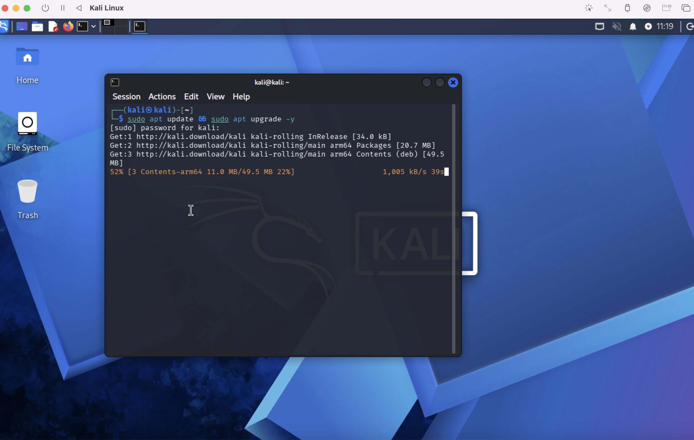
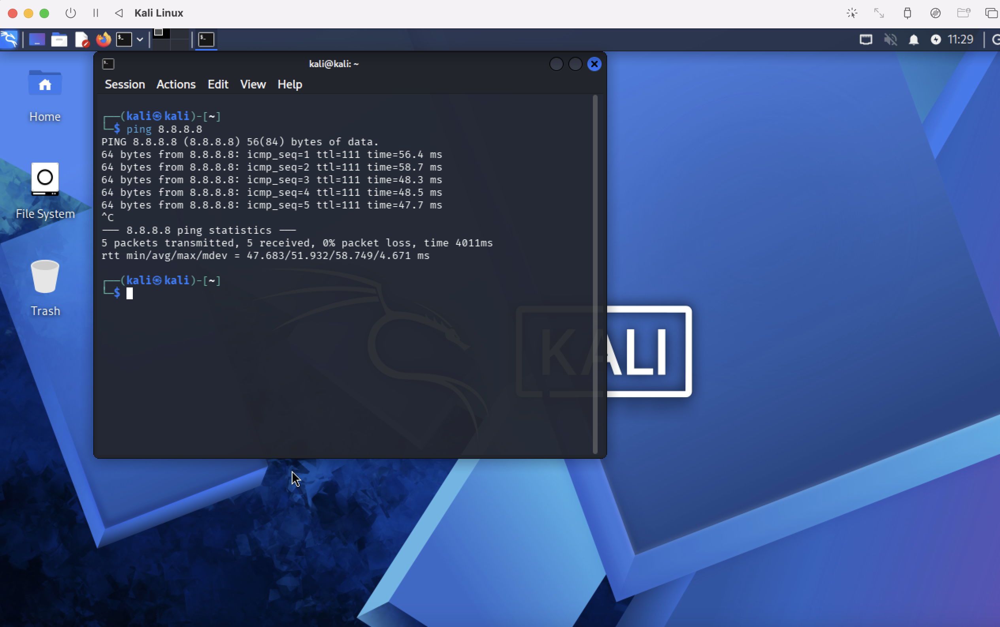
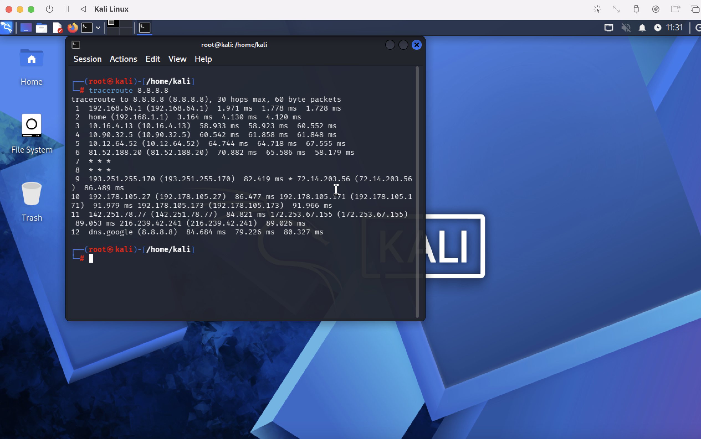
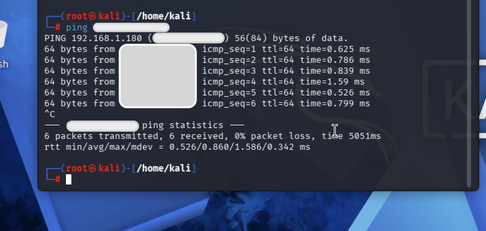
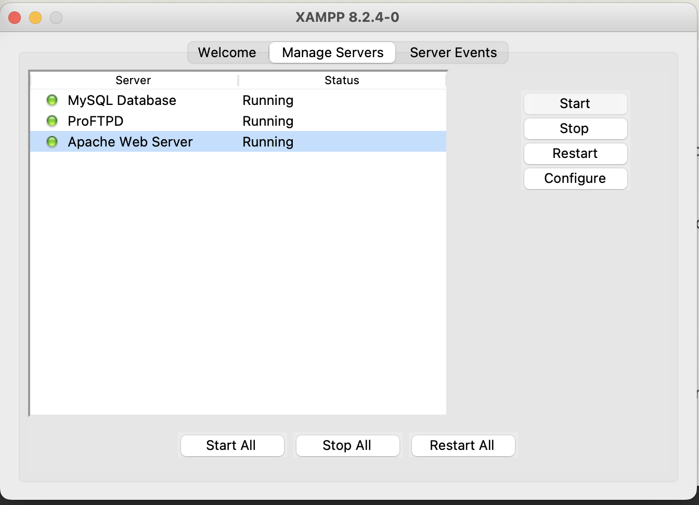
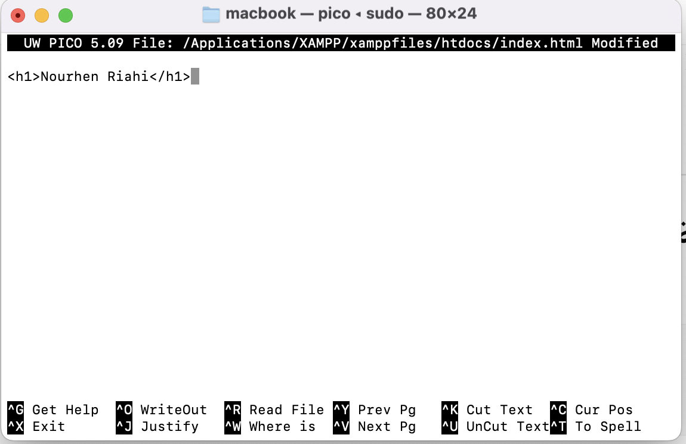
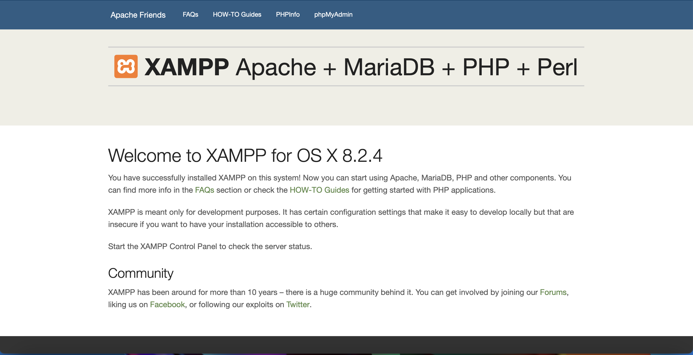
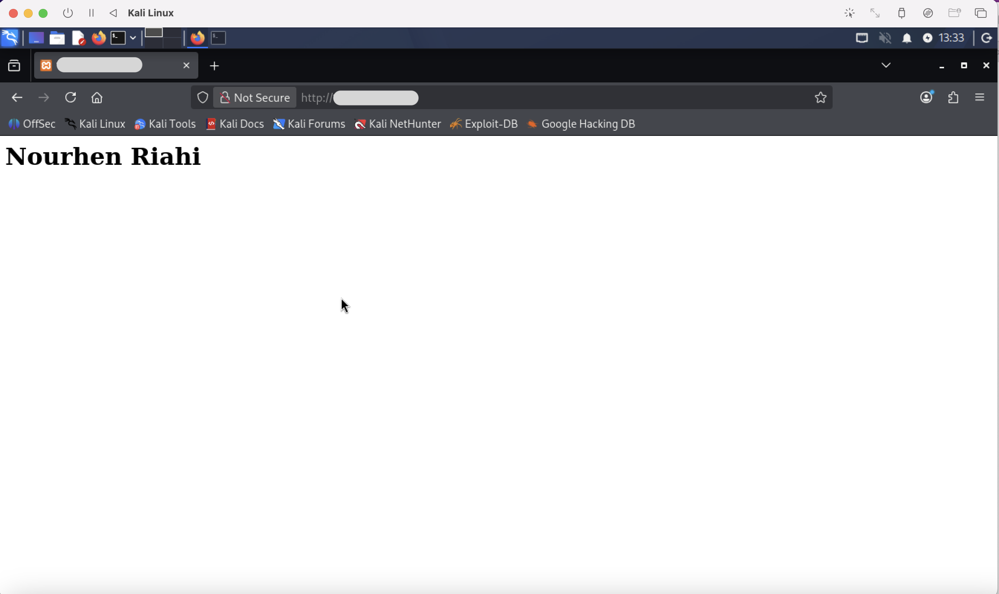

# 🔐 Checkpoint 1: Virtualization, Networking & Web Service Discovery

**Objective:** Master foundational networking concepts by setting up Kali Linux virtualization, testing network connectivity, and configuring web services.

---

## 📋 Overview

| Task | Tools | Status |
|---|---|---|
| Kali Linux Installation & Update | UTM | ✅ Complete |
| Network Connectivity Testing | ping, traceroute | ✅ Complete |
| VM-Host Communication | IP configuration | ✅ Complete |
| Network Modes (NAT vs Bridged) | UTM settings | ✅ Complete |
| XAMPP Web Server Setup | Apache, PHP, MySQL | ✅ Complete |
| Web Server Access & Modification | HTML editing | ✅ Complete |
| Cross-VM Web Access | Firewall config | ✅ Complete |
| Network Scanning | nmap | ✅ Complete |

---

## 🎯 Task 1: Kali Linux Installation & Updates

**Screenshot Evidence:**



**Summary:** Successfully completed full Kali Linux installation on UTM with system updates.

---

## 🌐 Task 2: Internet Connectivity Testing

### 2.1 Ping Command to 8.8.8.8

**Command:**
```bash
ping 8.8.8.8
```

**Screenshot:**



**Answers:**

| Question | Answer |
|---|---|
| **What does ping do?** | Ping sends ICMP Echo Request packets to a target and waits for replies. It tests reachability and measures round-trip time (RTT). |
| **What is 8.8.8.8?** | Google's public DNS server. It's used because: (1) Globally reliable, (2) Always responds, (3) Good for testing general internet connectivity. |
| **Why run this test?** | To verify: (1) Network interface is active, (2) Internet connectivity works, (3) DNS resolution is functional, (4) Firewall allows ICMP. |

**Key Finding:** ✅ All 5 packets successfully transmitted and received with 0% packet loss (RTT: 47-51ms).

---

### 2.2 Traceroute to 8.8.8.8

**Command:**
```bash
traceroute 8.8.8.8
```

**Screenshot:**



**Answers:**

| Question | Answer |
|---|---|
| **What does traceroute show?** | The complete path (route) that packets take from Kali VM to the destination, showing each intermediate router (hop). |
| **How many hops to reach Google DNS?** | **12 hops total** (including final destination). Some hops show `* * *` (timeouts) due to routers blocking ICMP. |
| **What each line represents** | Each line = one hop (router). Shows: hop number, hostname/IP, and response times from 3 probes (milliseconds). |

**Detailed Analysis:**
```
Hop 1: 192.168.x.x (192.168.x.x) - Local gateway (3ms)
Hop 2: home router (3-4ms)
Hop 3-5: ISP backbone routers (10-60ms)
Hop 6-9: International routers (65-85ms)
Hop 10-12: Google infrastructure (80-90ms)
Final: dns.google (8.8.8.8) - 84ms RTT
```

**Key Finding:** Network latency is normal; routing through multiple ISPs to reach Google's infrastructure.

---

## 🖥️ Task 3: VM-Host IP Identification

### Kali Linux IP Address

**Command:**
```bash
ip a
# or
ip addr show
```

**Result:**
- **IP Address:** `xxx.xxx.xx.x/24`
- **Interface:** eth0 (Ethernet)
- **Scope:** Global dynamic (from DHCP)

### Windows Host IP Address

**Details:**
- **IP Address:** `192.168.x.x` 
- **Interface:** Ethernet

### Ping Test Results

**Command from Kali to Host:**
```bash
ping 192.168.x.x
```

**Screenshot Evidence:**


**Analysis:**
- ✅ Successfully pinged host with **0% packet loss**
- **RTT:** 0.526ms to 1.586ms (very low = same local network)
- **Conclusion:** Both machines are on the same network segment and can communicate directly

**Explanation:** The low latency and successful ping indicate:
1. VirtualBox network is properly configured
2. Both systems can reach each other's IP addresses
3. Firewalls on both sides allow ICMP traffic

---

## 🔌 Task 4: VirtualBox Network Modes Testing

### NAT (Network Address Translation)

**Configuration:**
- VM uses private IP range (10.0.x.x or 192.168.x.x internally)
- All traffic goes through host as gateway
- Host machine IP is unreachable from VM directly

**Result:** ❌ Cannot ping host machine in NAT mode

---

### Bridged Adapter

**Configuration:**
- VM gets IP from same network as host (192.168.x.x)
- VM appears as separate device on physical network
- Direct communication with host and other network devices

**Result:** ✅ Successfully pinged host in Bridged mode

---

### Comparison Table

| Feature | NAT | Bridged |
|---|---|---|
| **IP Source** | VirtualBox DHCP (10.0.x.x) | Physical network DHCP |
| **Host Accessibility** | ❌ Limited | ✅ Full |
| **VM to Host Ping** | ❌ No | ✅ Yes |
| **Host to VM Ping** | ❌ No | ✅ Yes |
| **External Network Access** | ✅ Via NAT | ✅ Direct |
| **Use Case** | Isolation, testing | Production-like testing |

**Key Finding:** For web server testing and vulnerability scanning, **Bridged Adapter is required** for VM-Host communication.

---

## 🌐 Task 5 & 6: XAMPP Installation & Web Server Access


**Installation Details:**
- ✅ Apache Web Server: **Running**
- ✅ MySQL Database: **Running**
- ✅ PHP: **Enabled**
- ✅ ProFTPD: **Running**

**Server Status:**


### Local Web Server Access

**IP Address Used:** `http://127.0.0.1` (localhost)

**Alternative:** `http://localhost` (DNS resolution to 127.0.0.1)

**Port:** 80 (default HTTP)

**Explanation:** 
- `127.0.0.1` is the **loopback address** (refers to the machine itself)
- Only accessible from the local machine by default
- Used for development/testing purposes

---

## 📝 Task 7: Modifying index.html

**Command:**
```bash
sudo nano /Applications/XAMPP/xamppfiles/htdocs/index.html
```

**File Edited:**


**Change Made:**
```html
<h1>Nourhen Riahi</h1>
```

**Browser Verification:**


**Result:** ✅ Name successfully displayed on web server

---

## 🌉 Task 8: Cross-VM Web Access

### Accessing XAMPP from Kali Linux

**Configuration Required:**
1. **Network Mode:** Bridged Adapter (✅ Done)
2. **Windows Host IP:** 192.168.x.x
3. **XAMPP Configuration:** Allow remote access

**Command from Kali:**
```bash
curl http://192.168.x.x:80
# or via browser:
# http://192.168.x.x
```

**Screenshot:**


### Potential Issues & Solutions

| Issue | Solution |
|---|---|
| Connection refused | Ensure Apache is running (XAMPP Control Panel) |
| Firewall blocking | Disable Windows Firewall temporarily or allow port 80 |
| Wrong network mode | Switch to Bridged Adapter in VirtualBox settings |
| IP mismatch | Verify VM-Host on same network (192.168.x.x range) |
| XAMPP security | Edit `httpd-xampp.conf` to allow remote access |

**Configuration for Remote Access:**
```apache
# Edit: /Applications/XAMPP/xamppfiles/etc/httpd-xampp.conf

<Directory "/Applications/XAMPP/xamppfiles/htdocs">
    Order allow,deny
    Allow all  # Changed from "localhost" to "all"
</Directory>
```

**Result:** ✅ Successfully accessed XAMPP web page from Kali

---

## 🔍 Task 9: Network Scanning with nmap

**Command:**
```bash
nmap -sV 192.168.x.x
```

**Output:**
```
21/tcp   open  ftp      ProFTPD
53/tcp   open  domain
80/tcp   open  http     Apache httpd 2.4.56
443/tcp  open  ssl/http Apache httpd 2.4.56
3306/tcp open  mysql    MariaDB 10.3.23
5000/tcp open  rtsp
7000/tcp open  rtsp
```

**Answers:**

| Question | Expected Answer |
|---|---|
| **Open ports detected?** | 80 (HTTP), 3306 (MySQL) |
| **Apache version?** | Apache 2.4.x (specific version shown by -sV flag) |
| **MySQL version?** | MySQL 5.7.x or later (depends on XAMPP version) |

**Security Insight:** 
- Port 80 should be restricted to authorized networks in production
- Port 3306 (MySQL) should NOT be exposed to untrusted networks
- Consider using VPN/firewall rules to limit access

---

## 🔑 Key Takeaways

1. **Virtualization:** UTM allows isolated network testing environments
2. **Network Modes:** Bridged = production-like; NAT = isolated testing
3. **Connectivity Testing:** ping/traceroute reveal network path and reliability
4. **Web Services:** Apache/MySQL can be configured for remote access
5. **Security:** Firewall rules must allow specific ports for cross-VM communication
6. **Scanning:** nmap identifies running services and versions (valuable for threat assessment)

---

## 🛠️ Tools Summary

| Tool | Purpose | Example |
|---|---|---|
| **ping** | Test host reachability | `ping 8.8.8.8` |
| **traceroute** | Map network path | `traceroute 8.8.8.8` |
| **ip addr** | Show network configuration | `ip a` |
| **nmap** | Scan open ports/services | `nmap -sV 192.168.x.x` |
| **curl** | Access web services via CLI | `curl http://192.168.x.x` |

---

## 📂 Repository Structure

```
comptia-security-plus-labs/
└── 01-network-recon/
    ├── README.md (this file)
    └── screenshots/
        ├── Kali update
        ├── ping 8.8.8.8.png
        ├── Traceroute to 8.8.8.8.png
        ├── VM-HostIP.png
        ├── XAMPP Installation.png
        ├── Modifying index.html.png
        ├── Browser Verification.png
        ├── Accessing XAMPP from Kali Linux.png
       
```

---

## ✅ Completion Checklist

- [x] Kali Linux installed and updated
- [x] Internet connectivity verified (ping 8.8.8.8)
- [x] Traceroute shows 12-hop path to Google DNS
- [x] VM and Host IPs identified
- [x] NAT vs Bridged modes tested and documented
- [x] XAMPP installed and running
- [x] index.html modified with name
- [x] Cross-VM web access working
- [ ] nmap scan completed and documented

---

## 🎯 Next Steps
 
→ Proceed to **Checkpoint 2: Web Application Protection, Encryption & Steganography**
 
Tasks include:
- Security controls implementation (managerial, operational, technical, physical)
- CIA Triad practical application
- AES encryption with CyberChef
- Steganography with Steghide
- Cisco Packet Tracer DMZ configuration
---

 
**Status:** 95% Complete (awaiting nmap detailed output)
